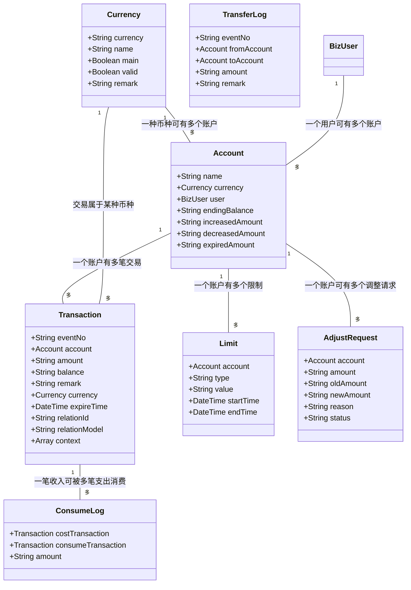
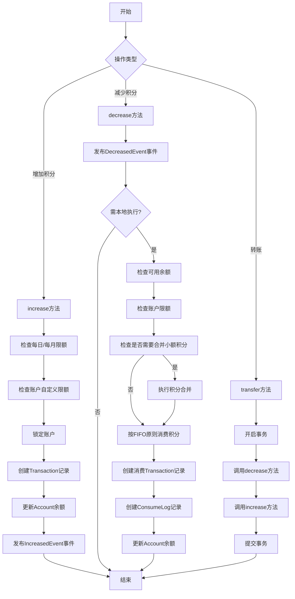
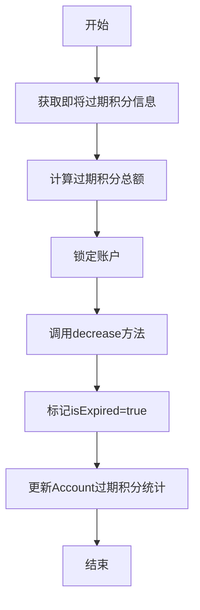
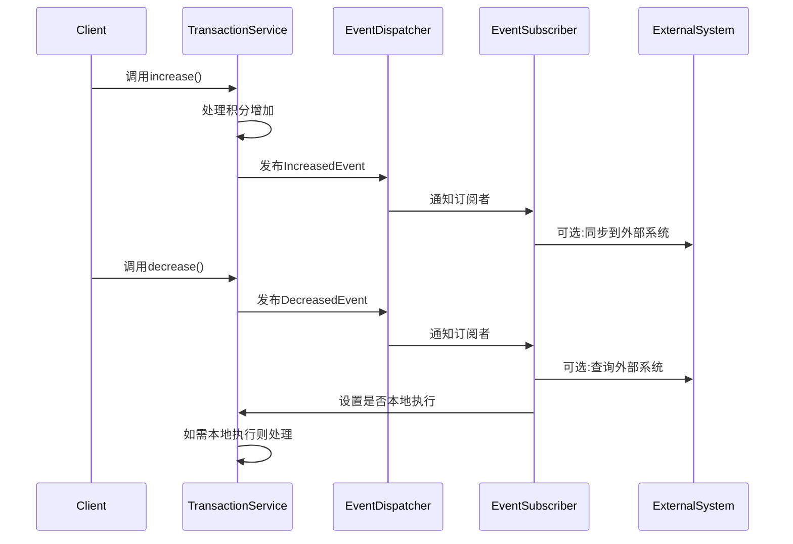
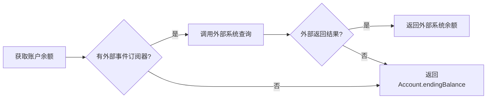
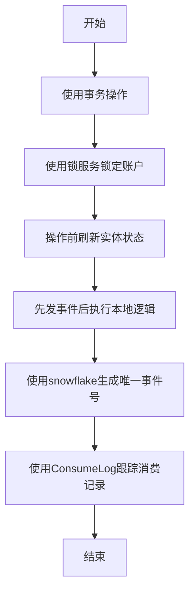
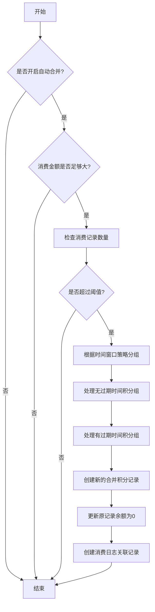
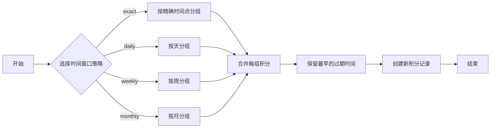
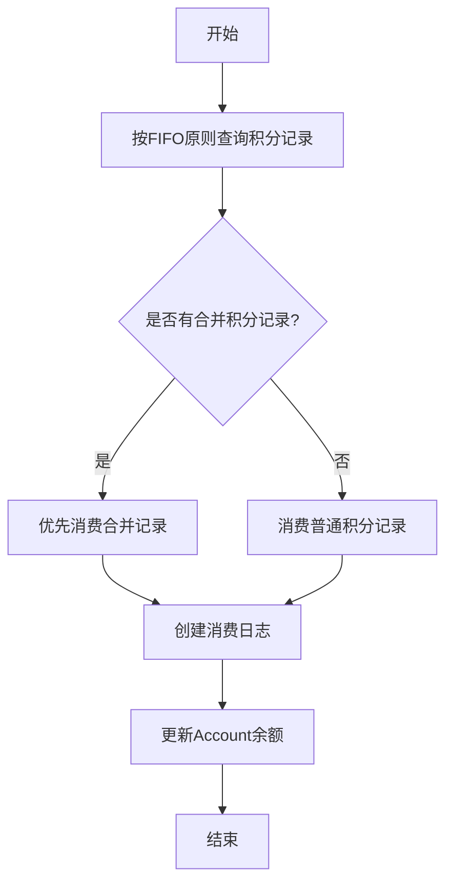

# CreditBundle 数据流转图

## 实体关系图

## 积分流转流程图

## 积分过期处理流程

## 事件系统数据流

## 账户余额计算逻辑

## 数据一致性保障流程

## 小额积分合并策略

## 时间窗口合并策略

## 积分合并后的消费流程

## 积分优化配置项

| 配置名称 | 说明 | 默认值 |
|---------|------|--------|
| CREDIT_AUTO_MERGE_ENABLED | 是否启用自动合并小额积分 | true |
| CREDIT_AUTO_MERGE_THRESHOLD | 触发合并的记录数阈值 | 100 |
| CREDIT_AUTO_MERGE_MIN_AMOUNT | 触发合并的最小消费金额 | 100.0 |
| CREDIT_MIN_AMOUNT_TO_MERGE | 被合并的最大积分额度 | 5.0 |
| CREDIT_TIME_WINDOW_STRATEGY | 时间窗口策略(exact/daily/weekly/monthly) | monthly |

## 时间窗口策略比较

| 策略名称 | 窗口粒度 | 合并效率 | 过期时间精度损失 | 适用场景 |
|---------|---------|---------|--------------|---------|
| exact | 精确到秒 | 低 | 无 | 过期时间精度要求高 |
| daily | 按天合并 | 中 | 最多1天 | 日常消费 |
| weekly | 按周合并 | 高 | 最多1周 | 大额频繁消费 |
| monthly | 按月合并 | 最高 | 最多1个月 | 大额不频繁消费 |
